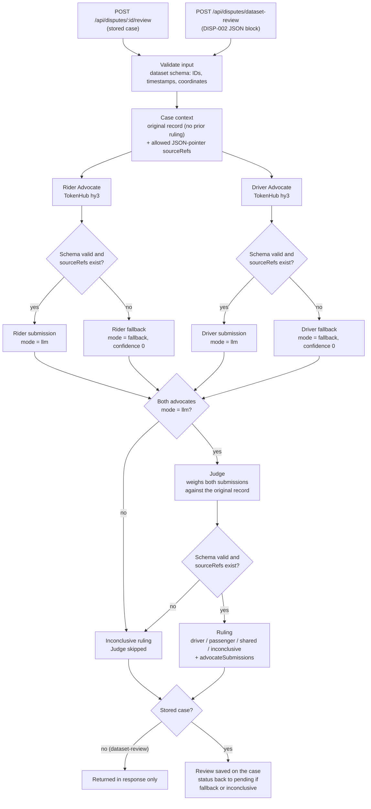

# 司乘纠纷审查 Agent — Dispute Review Agent

AI-assisted review of ride-hailing disputes between drivers and riders. Reviewers submit cases,
upload evidence (PDFs, screenshots, photos, notes), pull company records, and ask questions that
are answered from that evidence with cited sources.

- **Frontend:** React 19 + Vite + TanStack Query + shadcn/ui + Tailwind CSS 4 (`frontend/`, port 5173)
- **Backend:** Express + TypeScript + Zod (`backend/`, port 3000, API under `/api`)
- **Knowledge base:** PostgreSQL + pgvector, local models via Ollama — all open source, no API keys

Feature list: [`docs/product/features.md`](docs/product/features.md) ·
Backend and API details: [`backend/README.md`](backend/README.md)

## How a dispute review works



The two advocates run in parallel and each sees the full record; the Judge only runs when both
produced validated output, and no fallback picks a winner. Details of the agent inputs, outputs
and failure rules: [`backend/src/modules/dispute/agents/README.md`](backend/src/modules/dispute/agents/README.md).

## Running locally

### Prerequisites

- Node.js 20+
- Docker (for PostgreSQL + Ollama) — or install PostgreSQL 13+ with pgvector 0.8+ and
  [Ollama](https://ollama.com) natively. On macOS the native Ollama app is much faster than Docker
  because it uses the GPU.

### 1. Start the database and models

```bash
docker compose up -d
docker compose exec ollama ollama pull bge-m3       # embeddings, ~1.2 GB
docker compose exec ollama ollama pull qwen2.5:7b   # answers, ~4.7 GB
```

With native Ollama, run `ollama pull bge-m3 && ollama pull qwen2.5:7b` instead.

### 2. Backend (terminal 1)

```bash
cd backend
cp .env.example .env
npm install
npm run dev        # http://localhost:3000/api — creates the tables on first start
```

Check that everything is connected:

```bash
curl localhost:3000/api/knowledge/health
```

### 3. Frontend (terminal 2)

```bash
cd frontend
npm install
npm run dev        # http://localhost:5173 — /api is proxied to the backend
```

### 4. Load sample data (optional)

```bash
# Mock company records for the DISP-002 no-show dispute
curl -X POST 'localhost:3000/api/knowledge/company-records/import?wait=true' \
  -H 'Content-Type: application/json' -d '{"disputeId":"DISP-002"}'

# A policy PDF, shared by all cases
curl -X POST 'localhost:3000/api/knowledge/documents?wait=true' \
  -F "files=@../reference/Code of Conduct – RYDE _ World's First Real-Time Carpooling App.pdf"

# Ask a question
curl -X POST localhost:3000/api/knowledge/ask -H 'Content-Type: application/json' \
  -d '{"question":"Did the driver try to contact the rider?","caseId":"DISP-002"}'
```

## Notes

- **Low-RAM machines:** `qwen2.5:7b` needs about 5 GB of free memory. `LLM_MODEL=qwen2.5:1.5b` fits
  in less but gives noticeably less accurate answers.
- **Speed:** answers take seconds with a GPU / Apple Silicon and around a minute on CPU only.
- **AI case review** (`POST /api/disputes/:id/review`) still uses Tencent TokenHub
  (`TOKENHUB_API_KEY`). Without it the advocates fall back and the review is inconclusive. The
  knowledge base does not need it.
- **Company records** come from a mock of the internal API until `COMPANY_API_BASE_URL` is set.
- If PostgreSQL is not running the app still works; only `/api/knowledge/*` returns 503.
