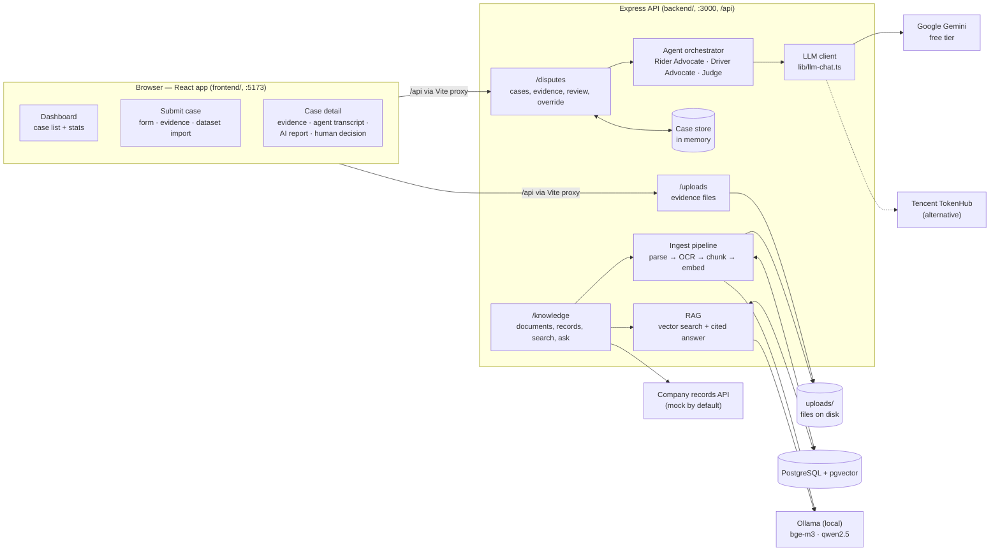
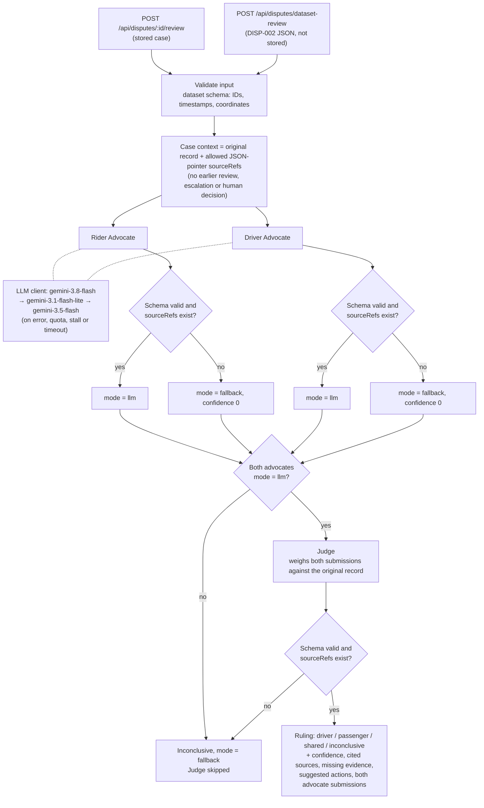
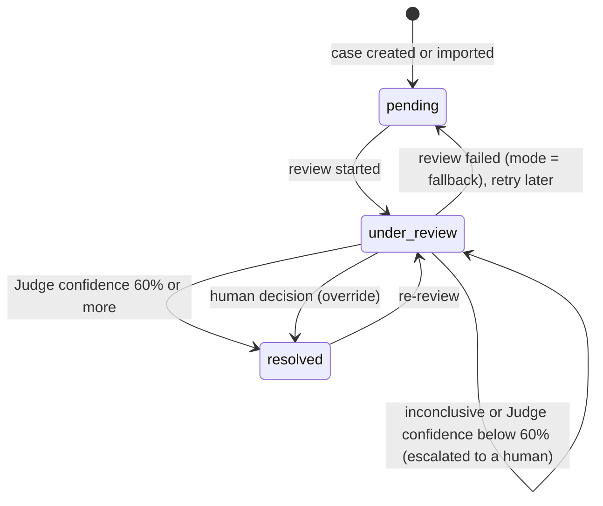

# 司乘纠纷审查 Agent — Dispute Review Agent

AI-assisted review of ride-hailing disputes between drivers and riders. Reviewers submit cases,
upload evidence (PDFs, screenshots, photos, notes), pull company records, and ask questions that
are answered from that evidence with cited sources.

- **Frontend:** React 19 + Vite + TanStack Query + shadcn/ui + Tailwind CSS 4 (`frontend/`, port 5173)
- **Backend:** Express + TypeScript + Zod (`backend/`, port 3000, API under `/api`)
- **Knowledge base:** PostgreSQL + pgvector, local models via Ollama — all open source, no API keys

Feature list: [`docs/product/features.md`](docs/product/features.md) ·
Backend and API details: [`backend/README.md`](backend/README.md)

## Architecture



| Component | Where | What it does |
|---|---|---|
| Dashboard / Submit / Case detail | `frontend/src/pages/` | Pages for listing cases, creating one (by form or by importing the DISP-002 dataset) and reviewing it |
| Agent review UI | `frontend/src/components/AgentReview.tsx` | Both advocates' submissions, the Judge's cited sources, the escalation panel and the human decision |
| Dispute routes + case store | `backend/src/modules/dispute/` | Case CRUD, evidence, review and human override; cases live **in memory** and reset on restart |
| Agents | `backend/src/modules/dispute/agents/` | Rider Advocate and Driver Advocate in parallel, then the Judge; every output is schema-checked and its citations verified |
| LLM client | `backend/src/lib/llm-chat.ts` | Gemini free tier (`gemini-3.8-flash`, then fallback models), or TokenHub when no Gemini key is set |
| Evidence uploads | `backend/src/modules/dispute/uploads.ts` | Stores photos and PDFs attached to evidence. The agents see the file name, not the file contents |
| Knowledge base | `backend/src/modules/knowledge/` | Parses, embeds and searches documents and company records, and answers questions with citations using local models. **API only**: it is not used by the agents and has no page in the UI yet |

## How a dispute review works



The two advocates run in parallel and each sees the full record. The Judge only runs when both
produced validated output, and no fallback ever picks a winner. Imported datasets are reviewed on
the original JSON, so evidence added to such a case after import is not used. Agent inputs, outputs
and failure rules: [`backend/src/modules/dispute/agents/README.md`](backend/src/modules/dispute/agents/README.md).

### Case status after a review



## Running locally

### Prerequisites

- Node.js 20+
- Docker (for PostgreSQL + Ollama) — or install PostgreSQL 13+ with pgvector 0.8+ and
  [Ollama](https://ollama.com) natively. On macOS the native Ollama app is much faster than Docker
  because it uses the GPU.

### 1. Start the database and models

```bash
docker compose up -d
docker compose exec ollama ollama pull bge-m3       # embeddings, ~1.2 GB
docker compose exec ollama ollama pull qwen2.5:7b   # answers, ~4.7 GB
```

With native Ollama, run `ollama pull bge-m3 && ollama pull qwen2.5:7b` instead.

### 2. Backend (terminal 1)

```bash
cd backend
cp .env.example .env   # then set GEMINI_API_KEY (free key: https://aistudio.google.com/apikey)
npm install
npm run dev        # http://localhost:3000/api — creates the tables on first start
```

Check that everything is connected:

```bash
curl localhost:3000/api/health/ready      # which LLM provider and models the agents will use
curl localhost:3000/api/knowledge/health  # database and local models
```

### 3. Frontend (terminal 2)

```bash
cd frontend
npm install
npm run dev        # http://localhost:5173 — /api is proxied to the backend
```

### 4. Load sample data (optional)

```bash
# Mock company records for the DISP-002 no-show dispute
curl -X POST 'localhost:3000/api/knowledge/company-records/import?wait=true' \
  -H 'Content-Type: application/json' -d '{"disputeId":"DISP-002"}'

# A policy PDF, shared by all cases
curl -X POST 'localhost:3000/api/knowledge/documents?wait=true' \
  -F "files=@../reference/Code of Conduct – RYDE _ World's First Real-Time Carpooling App.pdf"

# Ask a question
curl -X POST localhost:3000/api/knowledge/ask -H 'Content-Type: application/json' \
  -d '{"question":"Did the driver try to contact the rider?","caseId":"DISP-002"}'
```

## Notes

- **Low-RAM machines:** `qwen2.5:7b` needs about 5 GB of free memory. `LLM_MODEL=qwen2.5:1.5b` fits
  in less but gives noticeably less accurate answers.
- **Speed:** answers take seconds with a GPU / Apple Silicon and around a minute on CPU only.
- **AI case review** uses the Gemini free tier (`GEMINI_API_KEY`). `gemini-3.8-flash` is tried
  first; if it errors, hits its quota, stalls or times out, the client moves to
  `GEMINI_FALLBACK_MODELS` (default `gemini-3.1-flash-lite,gemini-3.5-flash`). The free tier
  allows only about 20 requests per model per day and a review makes 3 calls, so expect the
  fallback model to take over after a few reviews. A review takes 15 s – 3 min. With no key at
  all (Gemini or `TOKENHUB_API_KEY`) the review fails safely: inconclusive, and the case stays
  pending. The knowledge base does not need a key.
- **Cases are kept in memory:** created and imported cases, reviews and human decisions are lost
  when the backend restarts. Uploaded files and the knowledge base persist.
- **Company records** come from a mock of the internal API until `COMPANY_API_BASE_URL` is set.
- If PostgreSQL is not running the app still works; only `/api/knowledge/*` returns 503.
